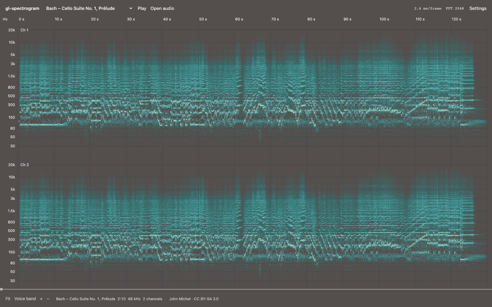

# gl-spectrogram

WebGL2 spectrogram renderer for audio editors. Each render computes what the view shows on the GPU: an FFT frame per device-pixel column, reassigned, so a steady tone draws one pixel row thin and a click one pixel column thin. Zooms, pans and frequency zooms draw sharp in the frame they happen, over an hour of 48 kHz audio.



[Demo](https://dy.github.io/gl-spectrogram/): a large canvas with the original compact controls and settings tucked away. The built-in samples include synthesized plucked strings with percussion, bird calls, voice, sweeps, chords, harmonics, clicks and noise. Play, pause and seek, open a local audio file, inspect frequency and level under the pointer, or stream a generated signal. Settings include palettes and their direction, log/mel/linear scales, frequency limits, FFT size, gain, automatic depth or explicit dB limits. Sound starts only when you press play.

Wheel or pinch to zoom time, drag to pan, Shift+wheel to zoom frequencies. Arrow keys pan, +/− zoom, Home fits the audio; **Voice band** focuses on 80–4,000 Hz. The current API computes the FFT from samples, so the controls expose its actual options rather than the old magnitude-frame smoothing and weighting settings.

[Audio stress test](https://dy.github.io/gl-spectrogram/example/stress.html): stereo speech with sweep, chord and click landmarks. `?minutes=60` makes an hour.

## Usage

`npm i gl-spectrogram`

```js
import Spectrogram from 'gl-spectrogram'

// the drawing buffer is yours to size
canvas.width = canvas.clientWidth * devicePixelRatio
canvas.height = canvas.clientHeight * devicePixelRatio

let sg = new Spectrogram(canvas, { data: samples, sampleRate: 48000 })  // mono Float32Array
sg.render()

// on every frame of a zoom or pan; zoomed out, columns take more frames over the next renders
function frame() {
  sg.update({ range: [from, to] }).clear().render()
  if (sg.pending) requestAnimationFrame(frame)
}
```

Silence is transparent: the canvas shows what is under it, and the default ramp from `background` to `color` assumes black there. Over a light page, `{ background: 'white', color: 'black' }`.

Stereo, as two lanes on one canvas:

```js
let lanes = [left, right].map((data, i) => new Spectrogram(canvas, { data, sampleRate, viewport: [0, i * 100, 800, 100] }))
for (let sg of lanes) sg.update({ range }).clear().render()
```

Spectrograms and [gl-waveform](https://github.com/dy/gl-waveform) lanes can share one `WebGL2RenderingContext`.

## API

### `new Spectrogram(target, options?)`

`target` is a canvas, whose WebGL2 context is created (`preserveDrawingBuffer: true`, `antialias: false`) or reused, or a `WebGL2RenderingContext` to share. The context needs `EXT_color_buffer_float`; without `EXT_float_blend` cells are half floats. Spectrograms on one context share their shader programs and FFT scratch; each has its own sample texture and cells. `options` go to `update()`.

### `sg.update(options)`

Option | Default | Meaning
---|---|---
`data` | empty | Mono samples; replaces all data. A `Float32Array` is referenced, not copied, and never written to; other array-likes are converted.
`sampleRate` | `44100` | Hz.
`range` | `[0, length]` | Visible `[from, to]` in samples: fractional, may extend past the data.
`scale` | `'log'` | Frequency axis: `'log'` (octaves) from 20 Hz, `'mel'`, `'erb'` (equal space per auditory filter, ERB-number 21.4 · log10(1 + 0.00437 f), Glasberg & Moore 1990) or `'lin'` from 0 Hz, to Nyquist.
`method` | `'reassigned'` | How a column draws its frames: `'frames'`, each frame's Hann spectrum as it is (Allen 1977); `'reassigned'`, each bin's power at the time and frequency its phase places it (Auger & Flandrin 1995): a tone one row thin, a click one column thin; `'synchrosqueezed'`, moved in frequency only, time staying the frame's (Thakur & Wu 2011); `'bands'`, frames of a length by band, long for the lows, short for the highs, as editors blend several lengths; `'tapers'`, three sine tapers' spectra averaged (Riedel & Sidorenko 1995): steadier noise; `'wigner'`, the pseudo Wigner–Ville distribution of the analytic signal under a Hann lag window (Ville 1948): lines thin without reassignment, and a cross-term between any two components. Each reads a full-scale sine at 0 dB.
`band` | whole axis | Visible `[low, high]` in Hz, bottom to top.
`viewport` | whole canvas | `[x, y, width, height]` in CSS px from the canvas' top-left corner.
`pixelRatio` | `devicePixelRatio` | Device px per CSS px.
`levels` | auto | `[floor, top]` in dB, 0 dB being a full-scale sine. Auto: the top is the whole data's loudest cell, never under -60 dB.
`depth` | `80` | dB from the top to the floor, with auto levels.
`gain` | `1` | Amplitude factor on the picture (power × gain²), as a preview of a level change.
`size` | fits the view | FFT size, a power of two from 16 to 16384. Auto: 40 ms (2048 at 48 kHz), longer while a bin spans over 4 rows in the middle of a zoomed band, up to 4096.
`color` | white | One color: the loudest level's, drawn at the coverage that steps lightness evenly over `background`. An array of colors: a colormap from the floor to the top. CSS colors, `oklch()` included, or `[r, g, b, a]` in 0..1.
`background` | black | What is under the canvas, where one color's ramp starts.

Keys left out keep their value, `null` restores the default. `update({ range })` only stores the range: cheap enough for every frame.

### Methods

Method | Does
---|---
`sg.render()` | Computes the columns the viewport shows that it lacks, then draws into the viewport, over what is there. Does nothing while the context is lost.
`sg.clear()` | Clears the viewport to transparent.
`sg.push(samples)` | Appends samples.
`sg.set(samples, offset)` | Writes samples from `offset`, extending the data if needed; a gap before `offset` reads as silence.
`sg.pick(x, y)` | The cell at `x`, `y` CSS px from the viewport's top-left: `{ from, to, low, high, level }`, samples `[from, to)`, Hz `[low, high)`, dB. `null` off the data.
`sg.pick(x)` | The column at `x`: `{ from, to, levels }`, a level per row from the bottom.
`sg.destroy()` | Releases the textures, the data and the event listeners.

Properties: `sg.gl`, `sg.canvas`, `sg.length`, `sg.range`, `sg.band` (Hz), `sg.levels` (dB), `sg.size` (FFT size of the view), `sg.pending` (the last render left columns short of frames: render again).

`import { scales } from 'gl-spectrogram'`: the axes the rows are spaced on, for labels that match them. `scales[name].at(f, lo, hi)` is where `f` Hz sits between `lo` and `hi`, 0..1; `.of(u, lo, hi)` is the frequency there; `.low` is the axis' floor.

## Rendering

* **Levels**: a cell holds the power reassigned into it, normalized so a full-scale sine reads 0 dB: Hann's coherent gain of 1/2 puts (N/4)² in the sine's bin and its main lobe holds 1.5 times that (Harris 1978, table 1), all of it moved into one cell. A sine of amplitude 0.1 reads -20 dB at any FFT size. Broadband energy sums over the cell's band, so noise reads the same at any FFT size too.
* **Reassignment** (Kodera, Gendrin & de Villedary 1976; Auger & Flandrin 1995): each bin's energy moves to the frequency and time its phase gives, k̂ = k − N/2π · Im(X_Dh X̄_h)/|X_h|² and t̂ = t + Re(X_Th X̄_h)/|X_h|². A steady sine is one row thin, a click one column thin, a sweep one line. Energy placed outside its frame's window or outside 0..Nyquist is dropped. Where two partials share a Hann lobe they interfere, which is what the 40 ms window avoids for voices and most music; `size` sets it.
* **Time**: column q spans samples [q·cw − ½, (q+1)·cw − ½), cw being samples per device pixel (one at least), so sample k's energy sits under x = k, where a waveform draws the sample. Columns are anchored to multiples of cw: a pan moves whole columns and computes only those it uncovers.
* **Zoomed out**, past half a window per column, a render gives each new column one frame, at its middle. Renders after it add frames, evenly across each column, until every sample is in one (hops of at most N/2); a column keeps the loudest of its frames' sums, so a click between frames shows once found. `pending` is true until then; a render adds about a frame per two pixel columns, 256 at least, so settling costs a few milliseconds a frame.
* **Auto levels**: the top is the loudest cell of the whole data drawn as 1024 × 512 cells, one frame each, reduced on the GPU and read by the draw shader, so it holds across zooms and costs no readback. A sine's onset reads above the sine: reassignment gathers the energy of an envelope's edges.
* **Color**: one color is drawn at the coverage that makes OKLab lightness (Ottosson 2020) step evenly over `background`, from its lightness at the floor to the color's at the top, transparent at the floor. A colormap's stops sit evenly from the floor to the top, interpolated in premultiplied OKLab.
* **NaN and ±Infinity** read as silence.
* **Blending** is premultiplied, over whatever is under the viewport. The context must have `premultipliedAlpha` (the default).
* **Context loss**: nothing throws while the context is lost; on restore, each spectrogram that had rendered uploads again and redraws.

## Architecture

1. Samples live in chunks of 64K, views into your array for `update({ data })`. On the GPU, an R32F array texture holds a layer per block of 2²⁰ samples, and an index maps blocks to layers, so gaps allocate nothing. Rows of 2048 samples go up when a frame first reads them: a view of an hour uploads its frames' rows, not the hour.
2. A render picks the columns under the viewport and finds them in a cache: cap × rows float cells, each slot tagged with its column. Missing columns are computed in runs; a run transforms every frame whose window reaches it but adds only into its own columns, so columns computed in turns hold what they would computed at once, whatever the pan.
3. FFT, one complex transform a frame: z[n] = x[n] · (1 + i·(n − N/2)·h[n]·2/N). Its real part is the rectangular spectrum X, from which Hann and its derivative are three neighbouring bins (X_h = X_k/2 − (X_k−1 + X_k+1)/4); its imaginary part carries the time-weighted Hann. Stockham autosort in fragment passes, radix 8 after a first stage of radix 2, 4 or 8 that gathers the windowed samples; twiddles from a table in doubles; two frames per RGBA32F texel, batches of 2²¹ texels. Samples are addressed as integers, so offsets past 10⁹ draw as offset 0 does.
4. Reassignment draws a point per frame and bin, at its column and row, into the cells with additive float blending. The row follows the scale's formula on the reassigned frequency; the column is counted from the frame's own, so a point lands in the same cell whichever run draws it.
5. Further frames of a zoomed-out column sum apart and join the cells by `MAX` blending.
6. The picture is one quad per viewport: cell, to dB, through a 256-texel color table.

Computing the same frames on the CPU in JavaScript, three FFTs each, takes about 340 ms per lane of 2880 columns on the machine below; here they take about 3.5 ms.

### Measured

`npm run bench`: headless Chromium 153 on an Apple M4 Max (Metal) with other jobs running (load average 23 to 27), two lanes of 1440×200 CSS px at DPR 2 (2880×400 device px each), synthetic speech at 48 kHz. GPU time per frame for both lanes, from `EXT_disjoint_timer_query_webgl2` (`gl.finish()` returns before the GPU is done in Chrome on Metal). Medians of three runs.

Samples | First picture | Whole view settles | Zoom frame, mean / p95 | Pan frame | Band zoom frame, mean / p95 | `push()` 0.1 s + frame | Unchanged frame
---|---|---|---|---|---|---|---
1M | 21 ms | at once | 6.6 / 14 ms | 0.9 ms | 12 / 21 ms | 7.4 ms | 0.3 ms
10M | 44 ms | 9 renders, 66 ms | 8.1 / 20 ms | 0.9 ms | 11 / 17 ms | 5.5 ms | 0.1 ms
172.8M (1 h) | 560 ms | 117 renders, 1.1 s | 10.9 / 26 ms | 1.1 ms | 12 / 18 ms | 5.0 ms | 0.1 ms

Zooming continuously on `requestAnimationFrame` runs at 59 to 60 fps at every size; each zoom frame recomputes every column. First picture is wall time from `update({ data })` to the pixels read back: upload of the rows the frames read, the whole data's picture for levels, the view. For an hour most of it is allocating the sample texture: 4 bytes a sample, 691 MB a lane. Other GPU memory: cells of 13 MB per cached view of this size (two kept a lane) and 2 MB for the whole data's; per context, a surface as large as the cells for refining and 64 MB of FFT scratch per FFT size in use (two kept).

## Changes from v1

v1 drew magnitude frames pushed to it one at a time, scrolling. v2 computes the spectrogram of samples it holds, for any view of them.

* ESM with a default export, WebGL2, no dependencies. Was CommonJS with gl-component, plot-grid, colormap and 8 more packages, and a 2D canvas version.
* Takes samples: `update({ data })`, `set()`, `push(samples)`. Was `push(magnitudes)`, a frame at a time.
* Draws a range, a band and a viewport, as gl-waveform does; reassigned, one row and one column thin.
* `color` is a color or a colormap of CSS colors; `levels`, `depth`, `band`, `scale` and `size` replace `minDecibels`/`maxDecibels`, `minFrequency`/`maxFrequency`, `logarithmic` and the data texture's `size`.
* Added: `pick()`, `pending`, `gain`, `scales`, context loss handling.
* Removed: the 2D renderer, `grid` and `axes` (draw them over or under the canvas), `weighting`, `smoothing`, `fill` by colormap name, `setFill()`, `setBackground()` (use `update()`), the `push` and `update` events, the `magnitudes` and `peak` properties, `container`, `context`.

## Develop

* `npm test`: every cell of 20 views against a CPU reference in doubles (three FFTs a frame, the reassignment formulas as written), within 0.01 dB, over log, mel and lin scales, zoomed bands, FFT sizes 256 to 2048, refined zoomed-out columns, offset 10⁹ and DPR 2; a full-scale sine on the row each scale's formula gives at 0 dB; a click on its column from 0.3 to 2880 samples per px; pans, `push()`/`set()` and refinement against fresh views; previews, levels, gaps, the color ramp's lightness, colormaps, half floats, stale texture layers, context loss, an hour of audio and the API contract. Headless Chromium through Playwright; `npx playwright install chromium` if it is missing.
* `npm run bench`: the table above.
* Demo: any static server at the repo root, e.g. `npx serve`, then open `/example/`. The previous large-audio demo is at `/example/stress.html`; `?minutes=60` makes an hour.

## License

© 2016 Dmitry Yv. MIT License
